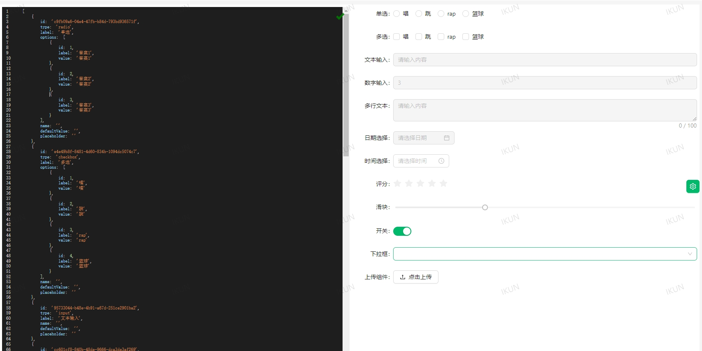
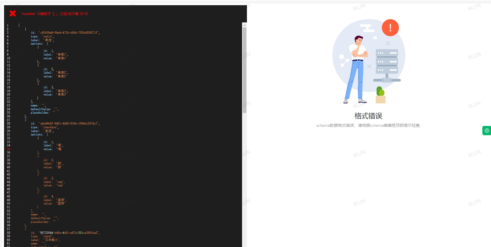

# <p align="center">基于web开发的可拖拽表单生成器</p>

[//]: # (https://github.com/ikatyang/emoji-cheat-sheet 表情仓库)


## 🎞️ 项目介绍

> 使用react开发，UI库使用antd。[项目地址](https://github.com/liumengniu/form-builder). \
> 最终生成的问卷的schema数据为json串，可以直接存储至服务端。 \
> web端拿到schema数据，可以生成在线web可拖拽表单生成器（实现中）。 \
> 代码基本是纯JS代码实现，除了UI库。 \
> 以下是项目原始示例，未经任何修改：
> 
> 
> 


## 🎨 运行指南

> 项目运行需要node环境 ，推荐node14+，作者使用的是node 16.13.1

> 1. 安装依赖

```bash
   npm install
```

> 2. 运行项目

```bash
   npm run start
```

> 3. 编译项目

```bash
   npm run build
```

## 💡 优化清单
> 需要优化的内容 2024/4/10
>
| 蓝图                       | 完成情况       | 存在问题        |
|--------------------------|------------|-------------|
| 1、增加更多的基础组件        | pending    |  |
| 2、增加更多操作项           | pending   |             |
| 3、增加更多的配置           | pending | 配置过少 |
| 4、增加不同的主题和皮肤      | pending | ui只有一套固定版式 |

## 🌟 Star History
<br>

[](https://star-history.com/#liumengniu/form-builder&Timeline)


